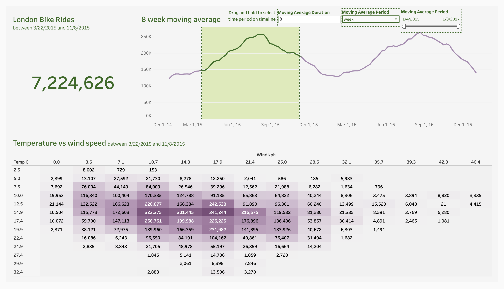

# London Bike Rides: Python + Tableau Dashboard

An interactive Tableau dashboard that explores two years of London bike-share demand. Python and pandas prepare the raw data, and Tableau turns it into a dashboard where you can pick any date range and see how rides change by time, weather, and season.

**[View the live dashboard on Tableau Public](https://public.tableau.com/app/profile/omar.shazley/viz/LondonBikeRides_17914418500610/Dashboard1)**

---

## Project Overview

| | |
|---|---|
| **Data** | [London Bike Sharing Dataset](https://www.kaggle.com/datasets/hmavrodiev/london-bike-sharing-dataset) (Kaggle) |
| **Time span** | January 4, 2015 to January 3, 2017 |
| **Size** | 17,414 hourly records, 10 columns |
| **Tools** | Python (pandas, zipfile, Kaggle API), Jupyter Notebook, Tableau Public |

!## 📷 Dashboard Preview

[](https://public.tableau.com/app/profile/omar.shazley/viz/LondonBikeRides_17914418500610/Dashboard1)

## Questions Explored

- How does bike demand rise and fall across the year?
- Which hours of the day are busiest?
- How does weather affect the number of rides?
- How many rides happened in any period a viewer chooses?

## Repository Contents

| File | Description |
|---|---|
| `london_bikes.ipynb` | Jupyter Notebook that downloads, cleans, and exports the data |
| `london_bikes_final.xlsx` | Cleaned dataset used as the Tableau data source |
| `LondonBikeRides.twb` | Tableau workbook with all sheets and the dashboard |
| `images/dashboard.png` | Screenshot of the finished dashboard |

The raw data is not stored here. The notebook downloads it from Kaggle.

## Data Preparation (Python)

1. Downloaded the dataset with the Kaggle API and extracted the zip file.
2. Loaded `london_merged.csv` into a pandas DataFrame and checked its shape, types, and value counts.
3. Renamed columns to clear names (for example, `cnt` to `count`, `t1` to `temp_real_C`, `hum` to `humidity_percent`).
4. Converted humidity from a 0 to 100 scale to a 0 to 1 decimal.
5. Mapped numeric codes to readable labels:
   - **Season:** 0 to 3 became spring, summer, autumn, winter
   - **Weather:** codes became Clear, Scattered clouds, Broken clouds, Cloudy, Rain, Rain with thunderstorm, Snowfall
6. Exported the cleaned data to `london_bikes_final.xlsx` for Tableau.

## Dashboard Features (Tableau)

The dashboard combines five sheets:

- **Moving Average:** a line chart of rides over time with an adjustable moving average.
- **Total Rides:** a dynamic total for the selected date range, with a title that updates to show the start and end dates.
- **Hour:** ride volume by hour of the day.
- **Weather:** rides by weather condition.
- **Heatmap:** <!-- EDIT: describe what your heatmap compares, e.g. hour of day by day of week -->

### Techniques Used

- **Parameters** let the viewer choose the moving average window (number of periods) and the date grain (day, week, or month).
- **Table calculation** for the moving average:
  ```
  WINDOW_AVG(SUM([Count]), -[Moving Average Duration] + 1, 0)
  ```
- **Set action:** dragging across the line chart adds those dates to a set, so the viewer picks the period of interest.
- **LOD calculations** find the start and end of the selected period and total the rides inside it:
  ```
  Min Month:        { MIN(IF [Moving Average Period Set] THEN [Moving Average Period] END) }
  Max Month:        { MAX(IF [Moving Average Period Set] THEN [Moving Average Period] END) }
  In Range:         [Moving Average Period] >= [Min Month] AND [Moving Average Period] <= [Max Month]
  In Range Rides:   { SUM(INT([In Range]) * [Count]) }
  ```
- **Reference band** shades the selected period on the chart, and color highlights the rides that fall inside it.

## Key Findings
- Ride demand follows a clear seasonal cycle, peaking in summer and dropping in winter.

## How to Reproduce

1. Clone this repository.
2. Install the Python packages:
   ```bash
   pip install pandas openpyxl kaggle
   ```
3. Set up a [Kaggle API key](https://www.kaggle.com/docs/api) and save `kaggle.json` in your `~/.kaggle/` folder.
4. Run `london_bikes.ipynb` to download and clean the data.
5. Open `LondonBikeRides.twb` in Tableau Public or Tableau Desktop and point it to `london_bikes_final.xlsx` if prompted.

## What I Learned

- Building an end-to-end workflow from a public API to a published dashboard
- Using parameters, set actions, and LOD calculations together to make a dashboard interactive
- Debugging Tableau issues such as date granularity and Null results from empty sets

## Acknowledgments

Data provided by Hristo Mavrodiev on Kaggle.

## Author

**Omar Shazley**
[LinkedIn](https://www.linkedin.com/in/YOUR-PROFILE) · [Tableau Public](https://public.tableau.com/app/profile/omar.shazley) · [GitHub](https://github.com/Bromar95)
